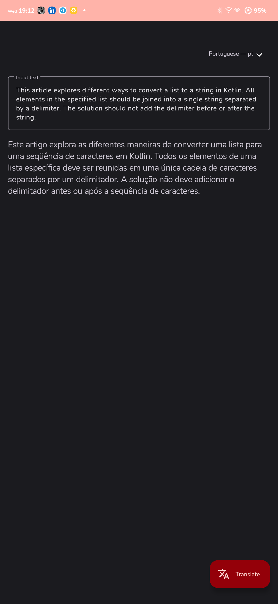

# JustTranslateAPI

This is a simple Android application to illustrate writing Clean Architecture with MVVM. This
application simply allows a user translate a string into multiple languages
using [Just Translated API](https://rapidapi.com/lebedev.str/api/just-translated/).

## Disclaimer.

- Complex architectures like the pure clean architecture can also increase code complexity since
  decoupling your code also means creating lots of data transformations(mappers) and models, that
  may end up increasing the learning curve of your code to a point where it would be better to use a
  simpler architecture like MVVM.

## Technical Summary

- [Dependency Injection - Dagger-Hilt](https://dagger.dev/hilt/): Hilt is a dependency injection
  library for Android that reduces the boilerplate of doing manual dependency injection in your
  project.
- [Model-View-ViewModel (MVVM)](https://en.wikipedia.org/wiki/Model%E2%80%93view%E2%80%93viewmodel):
  It is a software architectural pattern that facilitates the separation of the development of the
  graphical user interface.
- [Coroutines](https://developer.android.com/kotlin/coroutines): A coroutine is a concurrency design
  pattern that you can use on Android to simplify code that executes asynchronously.
- [Android Architecture Components](https://developer.android.com/topic/libraries/architecture):
  Collection of libraries that help you design robust, testable, and maintainable apps.
    - [Navigation](https://developer.android.com/guide/navigation): This component helps you
      implement navigation.
    - [Kotlin Flow](https://developer.android.com/kotlin/flow): In coroutines, a flow is a type that
      can emit multiple values sequentially, as opposed to suspend functions that return only a
      single value.
    - [LiveData](https://developer.android.com/topic/libraries/architecture/livedata): Data objects
      that notify views when the underlying database changes.
    - [ViewModel](https://developer.android.com/topic/libraries/architecture/viewmodel): Stores
      UI-related data that isn't destroyed on UI changes.
- [Retrofit 2](https://github.com/JakeWharton/retrofit2-kotlinx-serialization-converter): A Retrofit
  2 Converter.Factory for Kotlin serialization.
- [Moshi](https://github.com/square/moshi)
  & [Moshi Converter](https://github.com/square/retrofit/tree/master/retrofit-converters/moshi): A
  modern JSON library for Kotlin and Java. The converter uses Moshi for serialization to and from
  JSON.
- [Timber](https://github.com/JakeWharton/timber): A logger with a small, extensible API which
  provides utility on top of Android's normal Log class.

## Architecture.

### What is Clean Architecture?

A well planned architecture is extremely important for an app to scale and all architectures have
one common goal- to manage complexity of your app. This isn't something to be worried about in
smaller apps however it may prove very useful when working on apps with longer development lifecycle
and a bigger team.

Clean architecture was proposed
by [Robert C. Martin](https://en.wikipedia.org/wiki/Robert_C._Martin) in 2012 in
the [Clean Code Blog](http://blog.cleancoder.com/uncle-bob/2012/08/13/the-clean-architecture.html)
and it follow the SOLID principle.

<p align="center"></p>

The circles represent different layers of your app. Note that:

- The center circle is the most abstract, and the outer circle is the most concrete. This is called
  the [Abstraction Principle](https://en.wikipedia.org/wiki/Abstraction_principle_(computer_programming))
  . The Abstraction Principle specifies that inner circles should contain business logic, and outer
  circles should contain implementation details.

- Another principle of Clean Architecture is
  the [Dependency Inversion](https://en.wikipedia.org/wiki/Dependency_inversion_principle). This
  rule specifies that each circle can depend only on the nearest inward circle ie. low-level modules
  do not depend on high-level modules but the other way around.

### Why Clean Architecture?

- Loose coupling between the code - The code can easily be modified without affecting any or a large
  part of the app's codebase.
- Easier to test code.
- Separation of Concern - Different modules have specific responsibilities making it easier for
  modification and maintenance.

### S.O.L.I.D Principles.

- [__Single Responsibility__](https://en.wikipedia.org/wiki/Single-responsibility_principle): Each
  software component should have only one reason to change – one responsibility.

- [__
  Open-Closed__](https://en.wikipedia.org/wiki/Open%E2%80%93closed_principle#:~:text=In%20object%2Doriented%20programming%2C%20the,without%20modifying%20its%20source%20code.):
  You should be able to extend the behavior of a component, without breaking its usage, or modifying
  its extensions.

- [__Liskov Substitution__](https://en.wikipedia.org/wiki/Liskov_substitution_principle): If you
  have a class of one type, and any subclasses of that class, you should be able to represent the
  base class usage with the subclass, without breaking the app.

- [__Interface Segregation__](https://en.wikipedia.org/wiki/Interface_segregation_principle): It’s
  better to have many smaller interfaces than a large one, to prevent the class from implementing
  the methods that it doesn’t need.

- [__Dependency Inversion__](https://en.wikipedia.org/wiki/Dependency_inversion_principle):
  Components should depend on abstractions rather than concrete implementations. Also higher level
  modules shouldn’t depend on lower level modules.

## Getting started

There are a few ways to open this project.

### Android Studio

1. `Android Studio` -> `File` -> `New` -> `From Version control` -> `Git`
2. Enter `git@github.com:mbobiosio/JustTranslatedAPI.git` into URL field an press `Clone` button 3,
   Build the project and run on an android device or emulator

### Command-line + Android Studio

1. Run `git clone git@github.com:mbobiosio/JustTranslatedAPI.git` command to clone project
2. Open `Android Studio` and select `File | Open...` from the menu. Select cloned directory and
   press `Open` button
3. Build the project and run on an android device or emulator

You need to supply your API key. You can get a free api key
from `https://rapidapi.com/lebedev.str/api/just-translated/`.

When you obtain the key, you can provide them to the app by creating `keys.properties` file in your
project root folder:

```properties
apiKey="apiKey"
```

## Screenshots


### Author

* [Mbuodile Obiosio](https://linktr.ee/mbobiosio/)
* [](https://twitter.com/cazewonder)

## 📝 License
This project is released under the MIT license.
See [LICENSE](./LICENSE) for details.

```
MIT License

Copyright (c) 2022 Mbuodile Obiosio

Permission is hereby granted, free of charge, to any person obtaining a copy
of this software and associated documentation files (the "Software"), to deal
in the Software without restriction, including without limitation the rights
to use, copy, modify, merge, publish, distribute, sublicense, and/or sell
copies of the Software, and to permit persons to whom the Software is
furnished to do so, subject to the following conditions:

The above copyright notice and this permission notice shall be included in all
copies or substantial portions of the Software.

THE SOFTWARE IS PROVIDED "AS IS", WITHOUT WARRANTY OF ANY KIND, EXPRESS OR
IMPLIED, INCLUDING BUT NOT LIMITED TO THE WARRANTIES OF MERCHANTABILITY,
FITNESS FOR A PARTICULAR PURPOSE AND NONINFRINGEMENT. IN NO EVENT SHALL THE
AUTHORS OR COPYRIGHT HOLDERS BE LIABLE FOR ANY CLAIM, DAMAGES OR OTHER
LIABILITY, WHETHER IN AN ACTION OF CONTRACT, TORT OR OTHERWISE, ARISING FROM,
OUT OF OR IN CONNECTION WITH THE SOFTWARE OR THE USE OR OTHER DEALINGS IN THE
SOFTWARE.
```
